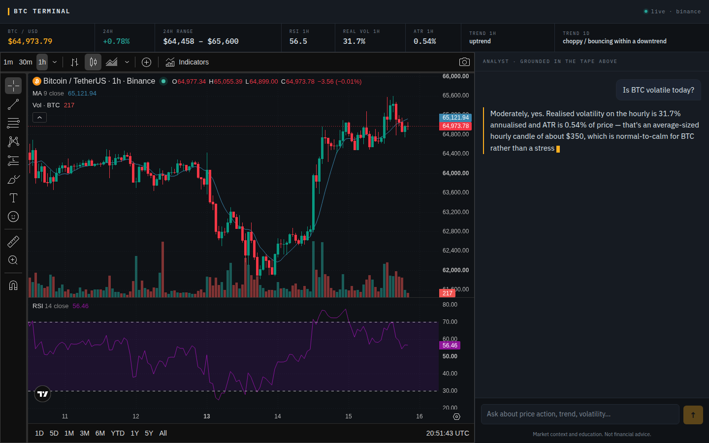
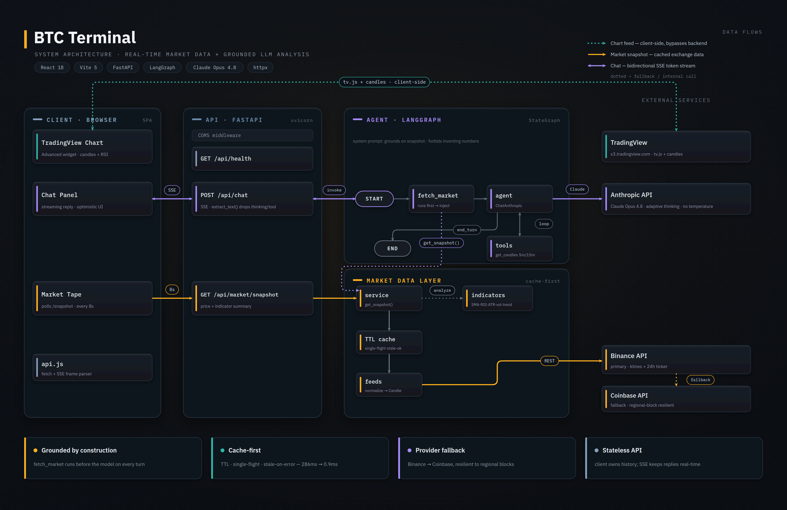

# BTC Terminal

A split-screen Bitcoin dashboard: a live TradingView candlestick chart on the
left, and a chat panel on the right where an LLM answers trading questions
grounded in real, freshly-fetched market data.

Ask *"Is BTC volatile today?"* and it answers from this hour's realised
volatility and ATR — not from training-data priors.



---

## Quick start

You need **Python 3.10+**, **Node 18+**, and an [Anthropic API key](https://console.anthropic.com/settings/keys).

```bash
# 1. Add your API key
cp .env.example .env        # then edit .env and paste your key

# 2. Backend  (terminal 1)
cd backend
python3 -m venv .venv && .venv/bin/pip install -r requirements.txt
.venv/bin/python -m uvicorn app.main:app --reload --port 8010

# 3. Frontend (terminal 2)
cd frontend
npm install
npm run dev
```

Open **http://localhost:5173**.

> **Port note:** the backend runs on **8010**, not the usual 8000, which is
> commonly already occupied. To change it, update the `--port` flag and the
> proxy target in `frontend/vite.config.js` together.

The market data feed needs no API key, so the chart, the tape, and
`/api/market/snapshot` all work before you add one. Only the chat needs a key.

---

## How it works



```
Browser
  ├── TradingView widget ─────────────► BINANCE:BTCUSDT candles
  └── /api/chat (SSE) ──► FastAPI ──► LangGraph
                                        │
                              START ─► fetch_market ─► agent ⇄ tools ─► END
                                            │            │
                                       TTL cache      Claude
                                            │
                                   Binance ─► Coinbase (fallback)
```

### Answers are grounded by construction

`fetch_market` runs **before** the model on every turn, so the snapshot is
always in context. This is the load-bearing design decision: if fetching were a
tool the model could choose to skip, *"is BTC volatile today?"* would sometimes
be answered from priors instead of today's tape. The model only gets a tool for
what the snapshot doesn't already carry (5m/15m intraday).

Each turn the model receives the live price, 24h stats, indicators across two
timeframes, and the last 24 hourly OHLC bars (~680 tokens). The prompt forbids
inventing numbers; when the feed is down it's told so explicitly rather than
being left to guess.

**The tape strip in the UI shows exactly the fields the model is given** — so
you can check its claims against the same numbers it saw.

### Indicators (`backend/app/market/indicators.py`)

Computed deterministically in Python, not by the model. An LLM asked to eyeball
168 candles and estimate volatility will confabulate a plausible number; the
split keeps answers grounded and lets the model do what it's good at —
interpretation and explanation.

| | |
|---|---|
| **Trend** | SMA20/SMA50 structure + SMA20 slope, with a flat-slope override so stacked-but-going-nowhere reads as range-bound rather than a trend |
| **Momentum** | RSI(14), Wilder's smoothing |
| **Volatility** | ATR(14) (absolute and % of price), annualised realised volatility, Bollinger width |
| **Position** | % from range high/low; changes over 1h/6h/24h/7d/30d |

Hourly covers 7 days, daily covers **90** — both must exceed 50 candles or
SMA50 is undefined and the trend can only ever answer "unknown".

### The caching layer

Every feed read goes through `TTLCache` (`backend/app/market/cache.py`), which
does three things, one per reason the cache exists:

- **TTL** (price 10s, candles 60s) — a burst of chat messages costs one upstream
  request, not one per message. Measured: **286ms cold → 0.9ms warm**.
- **Single-flight** — concurrent misses for the same key wait on one in-flight
  fetch instead of stampeding the feed.
- **Stale-on-error** — if a refresh fails but an expired value exists, serve it.
  A chatbot answering from data 90s old beats one returning an error.

For a multi-worker deploy this moves behind Redis with the same interface.

### Market data providers

Binance primary (free, keyless, deep history), Coinbase fallback. The fallback
isn't decorative: **Binance geo-blocks some regions, including the US**, so a
single-provider setup that works locally can fail on deploy. Both are
normalised to the same shape — Coinbase returns newest-first with a different
column order, which is exactly the kind of difference that silently corrupts
indicators if unhandled.

The chart points at `BINANCE:BTCUSDT` to match the backend's primary feed, so
the candles you see and the numbers the assistant quotes come from one venue.

---

## Claude integration notes

Using **Claude Opus 4.8** (`claude-opus-4-8`) via `langchain-anthropic`. Two
things about this model surface are easy to get wrong:

- **No sampling parameters.** Opus 4.8 removed `temperature`/`top_p`/`top_k` and
  **rejects them with a 400**. `ChatAnthropic` defaults `temperature` to `None`
  and omits it — but setting it passes it straight through and breaks every
  request. `build_llm()` deliberately never sets it.
- **Adaptive thinking is left on** (`thinking={"type": "adaptive"}`). With
  thinking disabled, Opus 4.8 tends to spill reasoning into the visible reply,
  which is worse in a chat panel than the small latency cost. `effort="low"` is
  what keeps it responsive.

Because thinking is on, streamed chunks carry `thinking` blocks (empty text —
`display` defaults to `"omitted"`) and `tool_use` blocks alongside `text`.
`extract_text()` in `main.py` filters to text only; without it, half-formed
tool-call JSON would stream into the chat bubble.

Set `ANTHROPIC_MODEL=claude-sonnet-5` in `.env` for a cheaper, faster swap — same
request surface, no code change.

**Prompt caching is deliberately not used.** Opus 4.8's minimum cacheable prefix
is 4096 tokens; the system prompt plus snapshot is ~1000. A `cache_control`
marker here would silently never hit while still costing the write premium.

---

## API

| Endpoint | Purpose |
|---|---|
| `GET /api/health` | Feed reachability + whether a key is configured |
| `GET /api/market/snapshot` | Live price + indicator summary (powers the tape) |
| `POST /api/chat` | Streams the reply as SSE |

`POST /api/chat` takes `{"messages": [{"role": "user"\|"assistant", "content": "…"}]}`
and streams frames of `{"type": "token"\|"tool"\|"done"\|"error", …}`. The client
owns conversation state and replays it each turn, which keeps the server
stateless; for durable history, add a LangGraph checkpointer keyed by thread_id.

---

## Tests

```bash
cd backend && .venv/bin/python -m pytest -q     # 46 tests, no API key needed
```

Covers indicator maths (RSI/ATR verified against Wilder's published reference
values), cache TTL/single-flight/stale-on-error, the SSE contract, and that live
market data actually reaches the model's context. The chat pipeline test stubs
only the Anthropic call, so the graph wiring and streaming are genuinely
exercised.

---

## What isn't here

- **Not financial advice**, and the assistant won't give it. Asked "should I
  buy?", it gives the setup, the specific risks, and what a trader would weigh —
  then notes the decision depends on risk tolerance and horizon it can't see.
- **No auth or rate limiting on the API.** Add both before exposing this
  publicly — `/api/chat` spends tokens on every call.
- **In-memory cache and client-side history**, so it's single-process. Redis and
  a checkpointer are the natural next steps.
- The free TradingView widget renders its own data feed. It agrees with the
  backend because both point at Binance, but they're separate connections — the
  chart may tick a moment before the tape's 10s cache refreshes.
